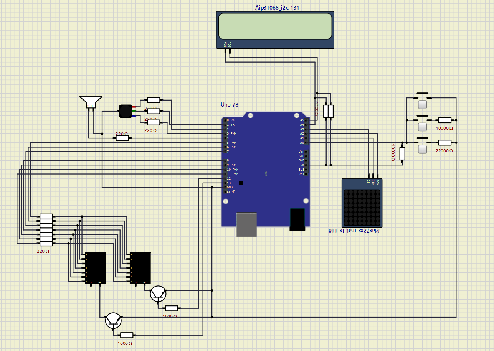

# Mapeamento de Hardware e Pinos

Configuramos as portas do microcontrolador ATmega328P para gerenciar os periféricos do sistema. Devido às limitações de pinos nativos, implementamos comunicação serial por software para o protocolo SPI da matriz de LEDs e para o protocolo I2C do display LCD. Os botões utilizam leitura analógica multiplexada por rede de resistores, e os displays de sete segmentos utilizam multiplexação por divisão de tempo.

# Visão Geral do Circuito no SimulIDE

O sistema foi modelado e testado através do SimulIDE para validar o comportamento elétrico dos periféricos antes da integração final com o código em Assembly e da montagem do circuito físico. A arquitetura física utiliza uma abordagem de barramentos e multiplexação para contornar a limitação de pinos de I/O do ATmega328P.

### Diagrama Geral do Circuito

# Funcionamento elétrico

* Teclado Analógico (Pino A0): Os botões de controle utilizam uma rede de resistores em paralelo associada a uma linha de leitura comum conectada ao pino analógico PC0. Cada chave aciona uma malha com resistores de valores distintos (10kΩ e 22kΩ). Quando um botão é pressionado, a resistência equivalente do circuito se altera, modificando o nível de tensão que chega no Conversor Analógico-Digital (ADC). O código identifica qual botão foi ativado com base no valor numérico dessa leitura.
* Matriz de LEDs 8x8 (Pinos A1, A2 e A3): A matriz é controlada através do módulo integrado MAX7219. Em vez de gerenciar individualmente as linhas e colunas do componente, o circuito utiliza apenas 3 linhas digitais para simular uma comunicação SPI (DIN, CLK e CS). O driver decodifica os comandos seriais e gerencia a varredura física dos LEDs de forma independente.
* Display LCD (Pinos A4 e A5): O display utiliza um controlador com interface I2C nativa, permitindo a comunicação apenas pelas linhas de dados (SDA) e clock (SCL). O barramento usa resistores de pull-up conectados à alimentação para garantir a integridade dos sinais digitais durante a atualização dos menus.
* Displays de 7 Segmentos (Pinos D5 a D13): Os dois displays compartilham o mesmo barramento físico para os pinos de segmentos (A a G), protegidos por resistores de 220Ω. O controle de ativação é feito por multiplexação no tempo através de dois transistores que atuam como chaves nos cátodos comuns. O software alterna a alimentação entre os displays de dezenas e unidades em alta frequência, criando a ilusão óptica de que os dois estão acesos ao mesmo tempo.
* Sinalização  de Cores e Áudio (LED RGB e Buzzer): O LED RGB possui resistores limitadores de corrente em seus terminais para os canais Vermelho, Verde e Azul, controlados por saídas digitais diretas. O Buzzer está conectado a um pino digital com resistor de proteção dedicado para a geração dos efeitos sonoros e músicas do jogo.

# Tabela de Pinagem

Abaixo está a pinagem completa do sistema:

| Pino Arduino | Porta AVR | Direção | Dispositivo Conectado | Função Lógica |
| :---: | :---: | :---: | :--- | :--- |
| A0 | PC0 | Entrada | Teclado de botões | Lê qual botão foi pressionado (leitura analógica) |
| A1 | PC1 | Saída | Matriz de LEDs (MAX7219) | Envio de dados para os desenhos da matriz (DIN) |
| A2 | PC2 | Saída | Matriz de LEDs (MAX7219) | Sinal de clock para sincronizar a matriz |
| A3 | PC3 | Saída | Matriz de LEDs (MAX7219) | Liga/desliga a comunicação com a matriz (CS) |
| A4 | PC4 | Entrada/Saída | Display LCD 16x2 | Linha de dados do LCD (SDA por código) |
| A5 | PC5 | Entrada/Saída | Display LCD 16x2 | Linha de clock do LCD (SCL por código) |
| D1 (TX) | PD1 | Saída | LED RGB - Canal Verde | Acende nos números Verdes (0) ou Player 3/4 |
| D2 | PD2 | Saída | LED RGB - Canal Vermelho | Acende nos números Vermelhos ou Player 1/4 |
| D3 | PD3 | Saída | LED RGB - Canal Azul | Acende nos números Pretos ou Player 2 |
| D4 | PD4 | Saída | Buzzer | Saída de som para os efeitos e músicas do jogo |
| D5 | PD5 | Saída | Display 7 Segmentos | Segmento A |
| D6 | PD6 | Saída | Display 7 Segmentos | Segmento B |
| D7 | PD7 | Saída | Display 7 Segmentos | Segmento C |
| D8 | PB0 | Saída | Display 7 Segmentos | Segmento D |
| D9 | PB1 | Saída | Display 7 Segmentos | Segmento E |
| D10 | PB2 | Saída | Display 7 Segmentos | Segmento F |
| D11 | PB3 | Saída | Display 7 Segmentos | Segmento G |
| D12 | PB4 | Saída | Cátodo de Dezenas (Esq.) | Ativa o display da esquerda (Dezenas) |
| D13 | PB5 | Saída | Cátodo de Unidades (Dir.) | Ativa o display da direita (Unidades) |

Durante a subrotina RESET no arquivo [src/main.asm](../../src/main.asm), as direções de dados das portas (registradores DDR) são inicializadas da seguinte forma:

### Configuração da Porta B (DDRB)
* Configuração: 0b00111111
* PB0 a PB3 são saídas (Segmentos D, E, F, G dos displays de 7 segmentos).
* PB4 e PB5 são saídas, para ligar e desligar cada display (seleção dos cátodos de dezenas e unidades).
* PB6 e PB7 são mantidos como entradas porque são usados fisicamente pelo cristal oscilador, que gera o sinal de clock para o microcontrolador funcionar.

### Configuração da Porta D (DDRD)
* Configuração: 0b11111110
* PD1 a PD3 são saídas digitais para controlar diretamente as cores verde, vermelha e azul do LED RGB.
* PD4 é uma saída digital para controlar a alimentação positiva do buzzer na geração de efeitos sonoros e das músicas.
* PD5 a PD7 são saídas para controlar individualmente os segmentos A, B e C dos displays de 7 segmentos.
* PD0 (Pino D0/RX) foi mantido como entrada livre por segurança.

### Configuração da Porta C (DDRC)
* Configuração: 0b00111110
* PC0 (Pino A0) é uma entrada analógica para realizar a leitura de tensão do teclado de botões.
* PC1 a PC3 (Pinos A1 a A3) são saídas digitais para simular as linhas de dados (DIN), sincronismo (CLK) e habilitação (CS) da matriz de LEDs.
* PC4 e PC5 (Pinos A4 e A5) são saídas digitais para realizar a comunicação por software com o display LCD através das linhas de dados (SDA) e clock (SCL).