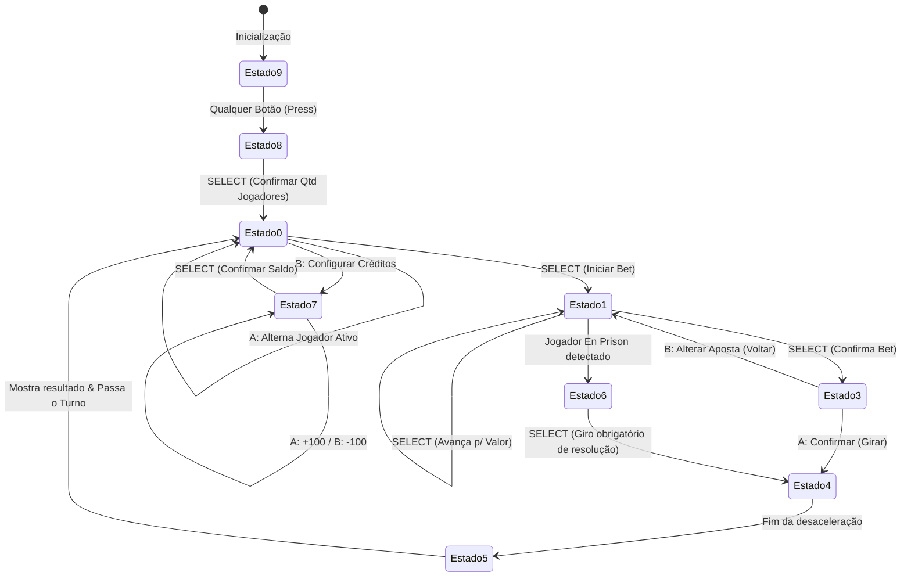

# Arquitetura de Software e Organização da Memória

Este documento descreve a infraestrutura e a organização interna do projeto, englobando o mapeamento de pinos do microcontrolador ATmega328P, a convenção rígida de registradores, o layout da SRAM e os estados da Máquina de Estados Finita (FSM).

---

## 1. Mapeamento de Hardware e Pinos

A pinagem do projeto foi otimizada para aproveitar os recursos integrados do ATmega328P, utilizando multiplexação por hardware para os displays de sete segmentos, bit-banging para protocolos de comunicação serial (I2C e SPI) e leitura analógica única (ADC) para o teclado com escada de resistores.

| Pino Arduino | Porta AVR | Direção | Dispositivo Conectado | Função |
| :--- | :--- | :--- | :--- | :--- |
| **A0** | PC0 | Entrada | Escada de Resistores | Teclado Analógico (ADC0) |
| **A1** | PC1 | Saída | Matriz de LEDs (MAX7219) | Linha de Dados Dinâmica (DIN) |
| **A2** | PC2 | Saída | Matriz de LEDs (MAX7219) | Clock Serial (SCK) |
| **A3** | PC3 | Saída | Matriz de LEDs (MAX7219) | Seleção de Chip (CS - Ativo Baixo) |
| **A4** | PC4 | E/S (OD) | LCD 16x2 (AIP31068/PCF8574) | Dados I2C (SDA) |
| **A5** | PC5 | E/S (OD) | LCD 16x2 (AIP31068/PCF8574) | Clock I2C (SCL) |
| **D1 (TX)** | PD1 | Saída | LED RGB - Canal Verde | Indica números 0 (Verde) |
| **D2** | PD2 | Saída | LED RGB - Canal Vermelho | Indica números Vermelhos |
| **D3** | PD3 | Saída | LED RGB - Canal Azul | Indica números Pretos (Azul) |
| **D4** | PD4 | Saída | Buzzer Piezo/Eletromagnético | Emite tons e reproduz trilhas de música |
| **D5** | PD5 | Saída | Display 7 Segmentos (Dez/Uni) | Segmento A |
| **D6** | PD6 | Saída | Display 7 Segmentos (Dez/Uni) | Segmento B |
| **D7** | PD7 | Saída | Display 7 Segmentos (Dez/Uni) | Segmento C |
| **D8** | PB0 | Saída | Display 7 Segmentos (Dez/Uni) | Segmento D |
| **D9** | PB1 | Saída | Display 7 Segmentos (Dez/Uni) | Segmento E |
| **D10** | PB2 | Saída | Display 7 Segmentos (Dez/Uni) | Segmento F |
| **D11** | PB3 | Saída | Display 7 Segmentos (Dez/Uni) | Segmento G |
| **D12** | PB4 | Saída | Catodo Comum Dezenas (Esq.) | Multiplexação (Ativo Baixo) |
| **D13** | PB5 | Saída | Catodo Comum Unidades (Dir.) | Multiplexação (Ativo Baixo) |

---

## 2. Gerenciamento de Registradores

Com o propósito de evitar conflitos entre o loop principal e as Rotinas de Serviço de Interrupção (ISRs), bem como garantir modularidade nas chamadas de subrotinas, foi instituída a seguinte divisão nos 32 registradores de uso geral do AVR (`R0` a `R31`):

### A. Registradores Temporários (Scratchpad) — `R16` e `R17`
* **Definições:** `.def temp = r16`, `.def temp2 = r17`
* **Uso:** Armazenamento local de curtíssimo prazo, operações lógicas com valores imediatos (`ldi`, `andi`, `ori`), controle de loops locais. Podem ser modificados livremente por qualquer função sem necessidade de preservação de estado na pilha.

### B. Registradores de Argumentos e Retornos — `R24` e `R25`
* **Definições:** `.def argument = r24`, `.def argument_h = r25`
* **Uso:** Passagem de parâmetros e retorno de subrotinas. Para dados de 8 bits, usa-se preferencialmente `r24`. Para inteiros de 16 bits, utiliza-se o par conjugado `r25:r24` (onde `r25` armazena o byte mais significativo - MSB, e `r24` o menos significativo - LSB).

### C. Registradores de Estado Global — `R20`, `R21` e `R22`
* **Definições:** `.def fsm_state = r20`, `.def active_plyr = r21`, `.def sys_flags = r22`
* **Uso:**
  - `fsm_state`: Estado lógico ativo da FSM do jogo.
  - `active_plyr`: ID (1 a 4) do jogador que está operando no momento.
  - `sys_flags`: Flags do sistema (exemplo: indica modo ativo durante a edição de aposta).
* **Regra:** Não podem ser modificados por rotinas de driver de baixo nível como registradores de trabalho.

### D. Ponteiros de Endereçamento Indireto — `X`, `Y` e `Z`
* **Ponteiro X (`R27:R26`):** Reservado estritamente para apontar para o bloco de RAM correspondente ao **jogador ativo** na SRAM.
* **Ponteiro Y (`R29:R28`):** Utilizado de forma genérica para apontar para buffers locais (como o buffer de renderização da matriz de LEDs `RAM_SCREEN_BUF`).
* **Ponteiro Z (`R31:R30`):** Reservado para acesso a dados alocados na memória Flash (memória de programa) usando a instrução `lpm`. É empregado no carregamento das fontes dos dígitos de sete segmentos, strings de menus do LCD e tabelas de notas musicais.

---

## 3. Organização e Gerenciamento da Memória SRAM

A memória SRAM no ATmega328P se inicia no endereço `0x0100` (`SRAM_START`). A alocação foi estruturada para suportar múltiplos jogadores de forma uniforme.

```
+-----------------------------------------------------------+
| Jogador X - Bloco de Memória na SRAM (16 bytes)           |
+---------------------+-------------------+-----------------+
| Offset 0x00 - 0x01  | Balanço (Pontos)  | 16-bit Integer  |
+---------------------+-------------------+-----------------+
| Offset 0x02         | Status Byte       | Flag En Prison  |
+---------------------+-------------------+-----------------+
| Offset 0x03         | Tipo de Aposta    | 0: Int, 1: Ext  |
+---------------------+-------------------+-----------------+
| Offset 0x04         | Alvo da Aposta    | N° ou Categoria |
+---------------------+-------------------+-----------------+
| Offset 0x05 - 0x06  | Valor da Aposta   | 16-bit Integer  |
+---------------------+-------------------+-----------------+
| Offset 0x07 - 0x0B  | Histórico Local   | 5 últimos giros |
+---------------------+-------------------+-----------------+
| Offset 0x0C - 0x0F  | Reservado         | Padding         |
+---------------------+-------------------+-----------------+
```

### Blocos de Dados dos Jogadores
* **Jogador 1:** `0x0100` - `0x010F`
* **Jogador 2:** `0x0110` - `0x011F`
* **Jogador 3:** `0x0120` - `0x012F`
* **Jogador 4:** `0x0130` - `0x013F`

Para carregar dinamicamente o ponteiro do jogador atual em `X`:
$$\text{Endereço Base} = 0x0100 + (\text{active\_plyr} - 1) \times 16$$

### Variáveis Globais de Jogo (a partir do endereço `0x0140`)
* `RAM_ROUND_NUM` (`0x0140`): O número atualmente selecionado ou sorteado (0 a 36).
* `RAM_GLOB_HIST` (`0x0141` - `0x0145`): Histórico global contendo os últimos 5 números sorteados na mesa.
* `RAM_SEED_L` / `RAM_SEED_H` (`0x0146` - `0x0147`): Semente de entropia de 16 bits para o PRNG.
* `RAM_SYS_TICKS` (`0x0148`): Contador de ticks (milissegundos) gerados em background.
* `RAM_BALL_IDX` (`0x0149`): Posição atual da bolinha na matriz de LEDs (0 a 19).
* `RAM_SCREEN_BUF` (`0x014A` - `0x0151`): Framebuffer da matriz de LEDs de 8 bytes (cada byte representa uma linha).
* `RAM_NUM_PLAYERS` (`0x0152`): Quantidade de jogadores ativos selecionada (1 a 4).
* `RAM_PWM_COUNTER` (`0x0153`): Contador de ciclos para o Soft-PWM do LED RGB.
* `RAM_PWM_RED` (`0x0154`), `RAM_PWM_GREEN` (`0x0155`), `RAM_PWM_BLACK` (`0x0156`): Intensidade (0-7) dos canais do LED RGB.
* `RAM_PWM_TICK` (`0x0157`): Contador para controle da transição de cores suave (Fade).
* `RAM_FADE_STATE` (`0x0158`): Estado atual da animação de Fade (Red $\rightarrow$ Blue $\rightarrow$ Green).
* `RAM_CURRENT_TRACK` (`0x0159`): ID da música atualmente selecionada (0 a 4).

---

## 4. Máquina de Estados Geral (FSM)

O fluxo principal do cassino é regulado por uma FSM contendo 10 estados distintos mapeados na constante `fsm_state` (`r20`).



### Detalhamento dos Estados Lógicos
1. **STATE_WELCOME (`9`):** Tela de boas-vindas com título "Roleta Francesa" no LCD, reproduzindo música no buzzer em loop com animação de bolinha correndo no prato da matriz de LEDs. SELECT alterna a música e A/B passam para a tela de jogadores.
2. **STATE_NUM_PLAYERS (`8`):** Seleção do número de jogadores participantes ($1$ a $4$) utilizando botões A e B para incrementar/decrementar e SELECT para salvar.
3. **STATE_MAIN_MENU (`0`):** Dashboard principal que exibe o saldo do jogador selecionado. Botão A alterna o jogador ativo, B abre a tela de créditos, e SELECT avança para o painel de aposta.
4. **STATE_CHOOSE_CAT (`1`):** Edição da aposta atual do jogador ativo. O cursor navega entre a escolha do alvo (números 0-36 ou categorias externas) e valor da aposta (passos de 100).
5. **STATE_CONFIRM_BET (`3`):** Tela de confirmação da aposta. Permite ao usuário validar (girar roleta) ou retornar para ajustar o valor e alvo.
6. **STATE_SPIN_ROULET (`4`):** Animação física do giro. A bolinha circula na matriz de LEDs, os displays de sete segmentos mudam dinamicamente acompanhando o prato e o buzzer emite cliques rápidos acelerando e desacelerando (friction).
7. **STATE_RESOLUTION (`5`):** Verifica os palpites, processa a matemática de ganho/perda de créditos de cada jogador, emite melodias de sucesso/falha e exibe o novo balanço.
8. **STATE_EN_PRISON (`6`):** Tratamento especial quando o número zero é sorteado. A aposta externa de dinheiro par fica aprisionada e o jogador é forçado a girar novamente na sua próxima vez para decidir o destino dos créditos presos.
9. **STATE_SET_CREDITS (`7`):** Ajuste de saldo inicial de cada jogador antes do início do jogo (incrementa/decrementa em passos de 100 pontos).
