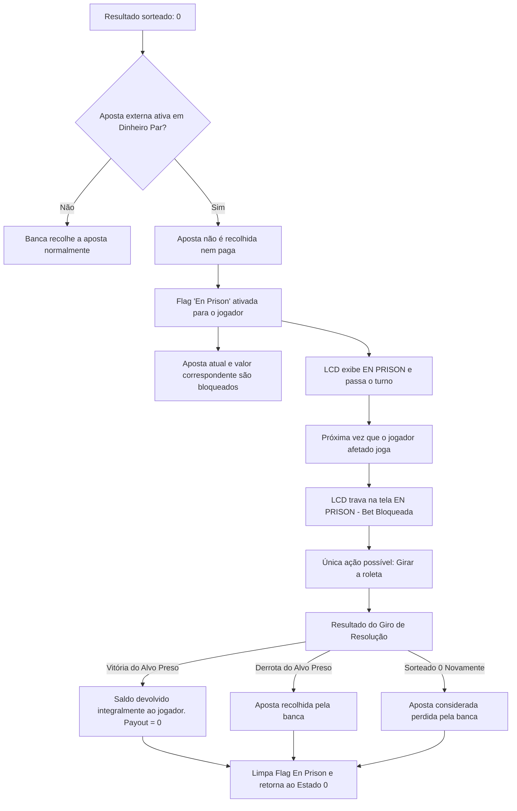

# Lógica do Jogo, Regras e Apostas

Este documento apresenta a especificação matemática e lógica dos subsistemas do jogo, o mapeamento de apostas da roleta, o gerador de números pseudo-aleatórios e a implementação detalhada das regras da Roleta Francesa, incluindo o funcionamento da regra especial "En Prison".

---

## 1. Mapeamento de Alvos de Aposta

Durante a fase de edição de aposta (`STATE_CHOOSE_CAT`), o jogador ativo escolhe um alvo navegando por um índice unificado de $0$ a $42$ (`NUM_BET_TARGETS = 43`). 
A subrotina `Map_Selection_To_Bet` traduz esse índice de seleção para o tipo real de aposta e o valor do alvo:

* **Índices Externos ($0$ a $5$):** Aposta do tipo Externa (`Bet Type = 1`). Os alvos correspondem às seguintes categorias de dinheiro par:
  - **Índice 0:** Vermelho (*Rouge*)
  - **Índice 1:** Preto (*Noir* / Exibido como **AZUL** no display devido à cor disponível no LED RGB)
  - **Índice 2:** Par (*Pair*)
  - **Índice 3:** Ímpar (*Impair*)
  - **Índice 4:** Baixo (*Manque* / Números 1 a 18)
  - **Índice 5:** Alto (*Passe* / Números 19 a 36)
* **Índices Internos ($6$ a $42$):** Aposta do tipo Interna (`Bet Type = 0`). O alvo é um número único exato calculado subtraindo `FIRST_INTERNAL_IDX` (6) do índice selecionado:
  $$\text{Número da Roleta} = \text{Índice Selecionado} - 6 \implies \text{Alvo} \in [0, 36]$$

---

## 2. Geração pseudo-aleatória (PRNG) por Entropia de Hardware

A roleta em Assembly puro implementa um mecanismo de sorteio justo e imprevisível a partir da captura de tempo humano.

### Captura de Semente
O **Timer 1** (temporizador de 16 bits) é configurado na inicialização do sistema para rodar continuamente na frequência máxima de clock de **16 MHz** (`TCNT1` incrementa a cada 62.5 nanossegundos). 
Como o momento exato em que um jogador pressiona um botão físico é variável na escala de milissegundos, essa variação funciona como uma excelente fonte de entropia real:
* Sempre que uma tecla é processada em `Wait_Button_Press`, o valor atual de `TCNT1` é capturado e salvo em RAM como semente (`RAM_SEED_H:RAM_SEED_L`).

### Algoritmo do PRNG (`PRNG_Spin`)
Sempre que a roleta é acionada:
1. O algoritmo lê o registrador de baixo nível do Timer 1 (`TCNT1L`) para capturar o valor de entropia instantâneo.
2. Aplica a operação matemática de módulo 37 por meio de um loop de subtrações sucessivas:
   ```
   Loop_Modulo:
       Se valor < 37 -> Fim
       valor = valor - 37
       Desvia para Loop_Modulo
   ```
3. O resultado final é um número inteiro uniforme entre **0 e 36**, que determina o slot da roleta onde a bola irá parar física e visualmente.

---

## 3. Sequência Física do Giro da Roleta

Para simular o atrito e movimento natural de desaceleração de uma roleta real (Friction Deceleration):
1. **Sorteio:** A subrotina `PRNG_Spin` sorteia o slot vencedor ($S_{win} \in [0, 36]$).
2. **Definição de Passos:** O número total de passos de animação é calculado para garantir que a bolinha dê no mínimo 2 voltas completas ao redor do prato da roleta antes de parar:
   $$\text{Passos Totais} = (\text{SPIN\_MIN\_LOOPS} \times 37) + S_{win} = 74 + S_{win}$$
3. **Animação Circular:** A bolinha é movida no sentido horário ao longo dos 20 LEDs da borda da matriz 8x8. O índice físico do LED ($L \in [0, 19]$) é mapeado a partir da posição da bolinha no prato da roleta real ($S \in [0, 36]$) pela fórmula linear:
   $$L = \left( \left\lfloor \frac{S \times 20}{37} \right\rfloor + 2 \right) \bmod 20$$
   *(O offset $+2$ alinha o número 0 da roleta no topo da matriz, indexado como LED 2).*
4. **Desaceleração (Friction):** O tempo de atraso (delay) entre os passos de rotação é aumentado gradualmente conforme a bolinha se aproxima do final:
   - Se faltam $\ge 40$ passos: delay de **10 ms** (giro muito rápido).
   - Se faltam entre 30 e 39 passos: delay de **20 ms**.
   - Se faltam entre 20 e 29 passos: delay de **40 ms**.
   - Se faltam entre 10 e 19 passos: delay de **80 ms**.
   - Se faltam entre 5 e 9 passos: delay de **150 ms**.
   - Se faltam entre 1 e 4 passos: delay de **250 ms** (quase parando).
5. **Efeitos Síncronos:** A cada passo, o buzzer emite um clique físico curto, o RGB acende na cor da casa atual, os displays de 7 segmentos mostram o número sob a bolinha em tempo real, e a matriz atualiza a posição do LED.

---

## 4. Regras e Pagamentos da Roleta Francesa

A resolução de apostas ocorre ao final do giro pela subrotina `Calculate_Payout`, baseando-se no layout da roleta europeia/francesa (37 casas).

### Verificação de Vitória (`Check_Bet_Win`)
Compara o resultado sorteado contra o alvo da aposta:
* **Aposta Interna (Número exato):** Vitória se o número sorteado for exatamente igual ao número apostado.
* **Aposta Externa (Vermelho/Preto):** Consulta a tabela `color_table` na Flash para descobrir se o número sorteado é da cor apostada. (Nota: Número 0 é verde e não ganha em Vermelho ou Preto).
* **Aposta Externa (Par/Ímpar):** Verifica se o número é diferente de 0 e se o bit menos significativo (LSB) do resultado atende à paridade.
* **Aposta Externa (Alto/Baixo):** Verifica se o número é diferente de 0 e se está nos intervalos:
  - **Baixo:** $1 \le N \le 18$
  - **Alto:** $19 \le N \le 36$

### Pagamentos Padrão (Payouts)
* **Vitória em Aposta Interna:** Payout de **35 para 1**. A subrotina multiplica o valor apostado por 36 (35 de prêmio mais o retorno do valor apostado) e soma ao saldo.
* **Vitória em Aposta Externa:** Payout de **1 para 1** (Even Money). Multiplica o valor apostado por 2 (1 de prêmio mais o retorno do valor apostado) e soma ao saldo.
* **Derrota (Geral):** O valor apostado é recolhido pela mesa e nenhuma soma é feita ao saldo.

---

## 5. A Regra Especial "En Prison" (Aprisionamento de Aposta)

A regra "En Prison" é um diferencial clássico da roleta francesa para suavizar perdas em apostas externas de dinheiro par (*Even Money*).

### Condição de Ativação
A regra é ativada se:
1. O resultado sorteado na roleta for **0 (Zero)**.
2. O jogador possuir uma aposta externa ativa de dinheiro par (Vermelho, Preto, Par, Ímpar, Baixo ou Alto).

### Comportamento da Regra
Quando ativada, a aposta **não é considerada perdida**. O dinheiro da aposta e o palpite são aprisionados pela banca:
* A flag *En Prison* (bit 0 do byte de status do jogador em SRAM) é ativada.
* O valor da aposta permanece alocado na SRAM e não é removido do jogador.
* O turno do jogo passa para o próximo jogador.



### O Giro de Resolução
No início do próximo turno do jogador afetado:
* A interface do LCD trava na tela com a mensagem **"P[ID]: PRISAO"** e exibe o valor retido. O teclado analógico é desativado para edição de saldo ou aposta.
* A única ação disponível para o jogador é pressionar o botão **Select** para iniciar um giro obrigatório de resolução.
* **Resolução do Giro:**
  - **Se o alvo aprisionado ganhar no sorteio:** A aposta é liberada. O valor original apostado é devolvido integralmente ao saldo do jogador (ganho líquido de 0 pontos). A flag *En Prison* é limpa.
  - **Se o alvo aprisionado perder no sorteio:** A aposta é formalmente recolhida pela banca (perdida). A flag *En Prison* é limpa.
  - **Se for sorteado 0 novamente:** Conforme as regras adotadas neste projeto, a aposta aprisionada é considerada perdida e recolhida pela banca, limpando a flag *En Prison*.
* Após o giro de resolução, o jogador é destravado e retorna ao menu principal (`STATE_MAIN_MENU`) no início da rodada regular seguinte.
