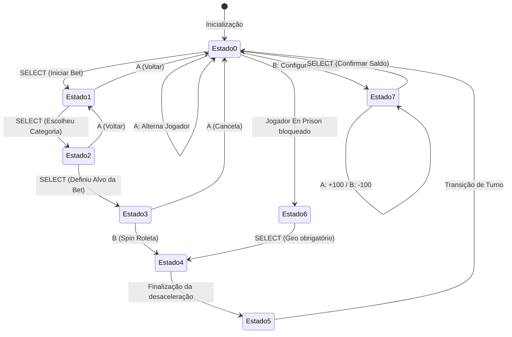
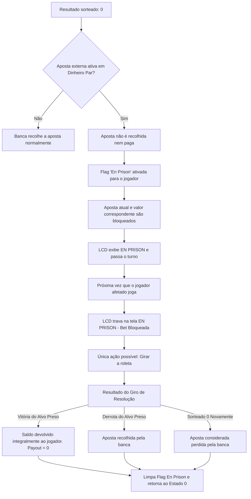

# Planejamento de Desenvolvimento: Roleta Francesa em Assembly AVR

Este documento apresenta o planejamento completo de arquitetura, software e hardware para a implementação da **Roleta Francesa** no microcontrolador ATmega328P (Arduino Uno) utilizando **Assembly AVR** puro. O projeto foi projetado para simulação no SimulIDE.

---

## 1. Mapeamento de Hardware e Pinos

A arquitetura do projeto utiliza conexões diretas para os displays de sete segmentos (multiplexação direta), bit-banging de I2C e SPI para os displays LCD e matriz de LEDs, e uma escada de resistores para otimizar o uso de pinos analógicos.

### Tabela de Pinos do Arduino Uno (ATmega328P)

| Pino Arduino | Porta AVR | Direção | Função / Dispositivo Conectado | Notas |
| :--- | :--- | :--- | :--- | :--- |
| **A0** | PC0 | Entrada | Escada de Resistores (3 botões) | Leitura Analógica (ADC) |
| **A1** | PC1 | Saída | Matriz LEDs 8x8 (MAX7219) - DIN | Entrada de dados seriais |
| **A2** | PC2 | Saída | Matriz LEDs 8x8 (MAX7219) - SCK | Clock de transmissão serial |
| **A3** | PC3 | Saída | Matriz LEDs 8x8 (MAX7219) - CS | Habilitação do chip (Ativo Baixo) |
| **A4** | PC4 | E/S (Open-Drain) | LCD 16x2 (AIP31068) - SDA | Linha de dados I2C (Bit-Banging, Pull-up externo de $4.7\text{ k}\Omega$) |
| **A5** | PC5 | E/S (Open-Drain) | LCD 16x2 (AIP31068) - SCL | Linha de clock I2C (Bit-Banging, Pull-up externo de $4.7\text{ k}\Omega$) |
| **D1 (TX)** | PD1 | Saída | LED RGB - Canal Verde (G) | Zero/Verde ($220\,\Omega$) |
| **D2** | PD2 | Saída | LED RGB - Canal Vermelho (R) | Números Vermelhos ($330\,\Omega$) |
| **D3** | PD3 | Saída | LED RGB - Canal Azul (B) | Números Pretos ($220\,\Omega$) |
| **D4** | PD4 | Saída | Buzzer (+) | Feedback sonoro (Cliques e Alertas) |
| **D5** | PD5 | Saída | Display 7 Segmentos - A | Segmento A ($220\,\Omega$) |
| **D6** | PD6 | Saída | Display 7 Segmentos - B | Segmento B ($220\,\Omega$) |
| **D7** | PD7 | Saída | Display 7 Segmentos - C | Segmento C ($220\,\Omega$) |
| **D8** | PB0 | Saída | Display 7 Segmentos - D | Segmento D ($220\,\Omega$) |
| **D9** | PB1 | Saída | Display 7 Segmentos - E | Segmento E ($220\,\Omega$) |
| **D10** | PB2 | Saída | Display 7 Segmentos - F | Segmento F ($220\,\Omega$) |
| **D11** | PB3 | Saída | Display 7 Segmentos - G | Segmento G ($220\,\Omega$) |
| **D12** | PB4 | Saída | Catodo Comum - Dezenas (Esquerdo) | Controle de multiplexação (Ativo Baixo) |
| **D13** | PB5 | Saída | Catodo Comum - Unidades (Direito) | Controle de multiplexação (Ativo Baixo) |

---

## 2. Subsistemas de Hardware e Cálculos

### A. Escada de Resistores para Botões (Pino A0 / ADC0)

A leitura dos três botões ocorre por meio do Conversor Analógico-Digital (ADC) configurado para resolução de 10 bits ($V_{REF} = 5\text{V}$, valores de $0$ a $1023$). 
Um resistor de pull-up principal de $10\text{ k}\Omega$ é conectado ao pino A0.

*   **Sem botões pressionados**: $V_{A0} \approx 5.0\text{V} \implies ADC \approx 1023$
*   **Botão A (Próximo / Cima)**: Conexão direta ao GND.
    $$V_{A0} = 0\text{V} \implies ADC \approx 0$$
*   **Botão B (Histórico / Baixo)**: Conexão ao GND através de $10\text{ k}\Omega$.
    $$V_{A0} = 5\text{V} \cdot \frac{10\text{ k}\Omega}{10\text{ k}\Omega + 10\text{ k}\Omega} = 2.5\text{V} \implies ADC \approx 512$$
*   **Botão Select (Confirmação)**: Conexão ao GND através de $22\text{ k}\Omega$.
    $$V_{A0} = 5\text{V} \cdot \frac{22\text{ k}\Omega}{10\text{ k}\Omega + 22\text{ k}\Omega} \approx 3.44\text{V} \implies ADC \approx 703$$

#### Limiares de Decisão (ADC):
*   **Botão A**: $0 \le ADC < 150$ (Centro teórico: 0)
*   **Botão B**: $450 \le ADC < 600$ (Centro teórico: 512)
*   **Botão Select**: $650 \le ADC < 800$ (Centro teórico: 703)
*   **Nenhum**: $ADC \ge 900$ (Centro teórico: 1023)

### B. Display LCD 16x2 via Protocolo I2C AIP31068

O LCD usa o controlador AIP31068 emulado por hardware I2C no SimulIDE no endereço de barramento de 7 bits **0x3E** (Endereço de escrita de 8 bits: **0x7C**).
O controle das linhas de barramento é emulado por software (Bit-Banging):
*   **Escrita de Comandos**: Enviar bit de controle `0x80`, seguido pelo byte de instrução.
*   **Escrita de Dados (Caracteres)**: Enviar bit de controle `0x40`, seguido pelo byte de caractere ASCII.

### C. Mapeamento de Segmentos dos Displays (Cátodo Comum)

Para exibir dígitos nos displays multiplexados diretamente, os bits de saída da porta D (PD5-PD7) e porta B (PB0-PB3) devem ser configurados simultaneamente:

| Dígito | Segmentos Ligados | PORTD (PD7-PD5) | PORTB (PB3-PB0) | Valor D (Hex) | Valor B (Hex) |
| :---: | :--- | :---: | :---: | :---: | :---: |
| **0** | A, B, C, D, E, F | `111` | `0111` | `0xE0` | `0x07` |
| **1** | B, C | `110` | `0000` | `0x60` | `0x00` |
| **2** | A, B, D, E, G | `110` | `1011` | `0x60` | `0x0B` |
| **3** | A, B, C, D, G | `111` | `1001` | `0xE0` | `0x09` |
| **4** | B, C, F, G | `110` | `1100` | `0x60` | `0x0C` |
| **5** | A, C, D, F, G | `101` | `1101` | `0xA0` | `0x0D` |
| **6** | A, C, D, E, F, G | `101` | `1111` | `0xA0` | `0x0F` |
| **7** | A, B, C | `111` | `0000` | `0xE0` | `0x00` |
| **8** | A, B, C, D, E, F, G | `111` | `1111` | `0xE0` | `0x0F` |
| **9** | A, B, C, D, F, G | `111` | `1101` | `0xE0` | `0x0D` |

---

## 3. Estruturas de Dados na SRAM (Memória Dinâmica)

Cada jogador ativo (limite de 4 jogadores) terá um bloco fixo de RAM de 16 bytes.

```
+-----------------------------------------------------------+
| Jogador X - Estrutura de Memória (16 bytes)              |
+---------------------+-------------------+-----------------+
| Offset 0x00 - 0x01  | Balanço (Pontos)  | 16-bit Integer  |
+---------------------+-------------------+-----------------+
| Offset 0x02         | Status Byte       | Flag En Prison  |
+---------------------+-------------------+-----------------+
| Offset 0x03         | Tipo de Aposta    | Int / Ext       |
+---------------------+-------------------+-----------------+
| Offset 0x04         | Alvo da Aposta    | N° ou Categoria |
+---------------------+-------------------+-----------------+
| Offset 0x05 - 0x06  | Valor da Aposta   | 16-bit Integer  |
+---------------------+-------------------+-----------------+
| Offset 0x07 - 0x0B  | Histórico Local   | 5 últimos giros |
+---------------------+-------------------+-----------------+
| Offset 0x0C - 0x0F  | Reservado         | Padding         |
+---------------------+-------------------+-----------------+
```

### Detalhes das Variáveis Globais de Jogo:
*   `ACTIVE_PLAYER`: Armazena o jogador atual ($1$ a $4$, mapeado no registrador `active_plyr` / `r21`).
*   `CURRENT_STATE`: Guarda o estado lógico da FSM (mapeado no registrador `fsm_state` / `r20`).
*   `ROUND_NUMBER`: Armazena o número sorteado (0 a 36, mapeado em `RAM_ROUND_NUM`).
*   `TMR1_SEED`: Armazena a semente de 16 bits capturada do temporizador (mapeado em `RAM_SEED_H:RAM_SEED_L`).

---

## 4. Máquina de Estados Geral (FSM)

O programa principal roda em uma FSM que atualiza a tela LCD e gerencia o teclado analógico sequencialmente.



### Estados Lógicos:
*   **Estado 0 (Idle / Painel Principal)**: Mostra pontos do jogador e sua última aposta. Permite alternar o jogador ativo (A) ou configurar seus créditos (B).
*   **Estado 1 (Seleção de Categoria)**: Permite escolher entre aposta *Internal* (número exato) ou *External* (dinheiro par/grupos).
*   **Estado 2 (Seleção Específica)**: Define o número (0 a 36) ou a categoria externa (Vermelho, Preto, Par, Ímpar, Alto, Baixo).
*   **Estado 3 (Confirmação)**: Aguarda confirmação com botão B (Spin) ou cancelamento com botão A.
*   **Estado 4 (Spin / Animação)**: Move o ponto luminoso na matriz 8x8 e pisca displays rapidamente. Emite feedback sonoro a cada passo ($T_{step}$ acumulado por fricção).
*   **Estado 5 (Resolução)**: Calcula ganhos e perdas, atualiza o saldo na SRAM e acende o LED RGB com a cor do número vencedor.
*   **Estado 6 (En Prison)**: Exibe tela com aposta aprisionada e restringe as opções de jogo até que o jogador resolva a aposta em um novo giro de roleta.
*   **Estado 7 (Configurar Crédito)**: Permite ajustar (adicionar/reduzir) o saldo inicial do jogador selecionado antes do jogo em passos de 100 pontos.

---

## 5. Regras Especiais da Roleta Francesa ("En Prison")

A regra "En Prison" aplica-se apenas sob a seguinte condição:
1. O resultado da roleta é **0 (Zero)**.
2. O jogador ativo possui uma aposta externa do tipo **Dinheiro Par** (*Even Money*), ou seja:
   *   Vermelho / Preto (*Rouge / Noir*)
   *   Par / Ímpar (*Pair / Impair*)
   *   Alto / Baixo (*Passe / Manque*)

### Comportamento da Regra:


---

## 6. Cronograma e Estratégia de Desenvolvimento

A implementação será dividida em etapas incrementais e estruturadas na pasta de código fonte:

1.  **Fase 1: Configuração e Setup Inicial (E/S)**
    *   Criação do esqueleto do arquivo de assembly `src/main.asm`.
    *   Definição de constantes, registradores e inicialização da pilha (Stack Pointer).
    *   Configuração dos registradores de E/S (`DDRB`, `DDRD`, `DDRC`).
2.  **Fase 2: I2C Bit-Banging & LCD Driver**
    *   Escrita das rotinas primitivas do barramento I2C (`i2c_start`, `i2c_stop`, `i2c_write`).
    *   Protocolo do controlador AIP31068 e rotina `lcd_init`.
    *   Funções de impressão de string na RAM/Flash e controle do cursor.
3.  **Fase 3: Teclado Analógico (ADC) & Máquina de Estados (FSM)**
    *   Rotina de conversão e filtragem de ruído no pino A0.
    *   Decodificação dos limiares de tensão correspondentes aos botões.
    *   Programação da navegação básica dos menus no LCD.
4.  **Fase 4: Drivers de Displays de 7 Segmentos e Buzzer**
    *   Multiplexação dinâmica (alternando a cada 2 ms).
    *   Conversão binário-para-BCD.
    *   Rotina de bipe sonoro para o buzzer.
5.  **Fase 5: Driver MAX7219 da Matriz LED & Lógica de Giro**
    *   Escrita do driver serial para o MAX7219.
    *   Efeito visual de rotação (bolinha circulando as bordas da matriz 8x8).
    *   Curva de desaceleração mecânica simulada por friction delay.
6.  **Fase 6: Regras de Negócio e "En Prison"**
    *   Gerador Pseudo-aleatório (PRNG) usando `TCNT1 % 37`.
    *   Mapeamento de Cores para o LED RGB.
    *   Validação das condições de ganho/perda de apostas.
    *   Fluxo lógico completo da regra "En Prison".
7.  **Fase 7: Integração Geral e Depuração**
    *   Compilação com `avra` ou `gavrasm` para gerar o arquivo `.hex`.
    *   Testes dinâmicos de usabilidade de botões e interface visual no SimulIDE.